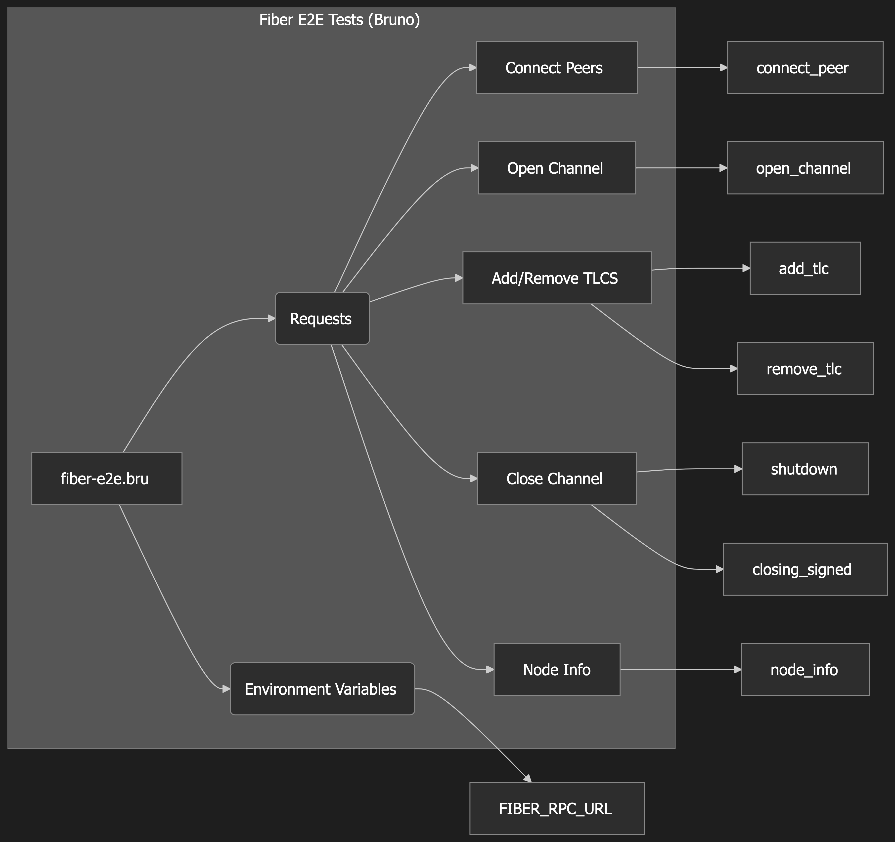

# CKB Fiber Docker

[](https://github.com/Flouse/ckb-fiber-docker/actions/workflows/docker.yml)
[][GHCR]

Docker image that contains the CKB [Fiber Network Node (FNN)](https://github.com/nervosnetwork/fiber) and [ckb-cli](https://github.com/nervosnetwork/ckb-cli) for easy deployment.


## Check the version
```bash
# https://github.com/nervosnetwork/fiber/releases/tag/v0.4.2
export FIBER_IMAGE=ghcr.io/flouse/ckb-fiber:v0.4.2

docker run --rm ${FIBER_IMAGE} ckb-cli --version
# Output: ckb-cli 1.12.0 (278c7be 2024-09-20)

docker run --rm ${FIBER_IMAGE}
# Ouptut: fnn 0.4.2
```

## Usage

```bash
# Fiber Help
docker run --rm ${FIBER_IMAGE} fnn --help

# Start a fiber node with ./testnet-config.yml
docker compose up -d

# Watch logs
docker compose logs -f

# Get node info
curl -s -X POST http://localhost:58227 \
  -H "Content-Type: application/json" \
  --data '{"id":2, "jsonrpc":"2.0", "method":"node_info", "params":[]}' 
```


## RPC docs of Fiber Network Node
See https://github.com/nervosnetwork/fiber/blob/main/src/rpc/README.md


### TODO

#### Faucet Testing

- [x] Add balance check before faucet request
- [x] Get CKB faucet if necessary

#### Peer Connection

- [x] Fetch peer list from testnet explorer
- [x] Implement connection to known peers
- [x] Verify successful peer connections

#### Channel Operations

- [ ] Test channel opening functionality
  - [x] CKB channel
  - [ ] USDI channel
- [ ] Implement channel listing
- [ ] Verify channel states

#### Payment Testing

- [ ] Setup key_send payment test
- [ ] Verify balance after payment success

#### Reuse the [tests of fiber](https://github.com/nervosnetwork/fiber/blob/f6aafb9423ef240385cc359e671095648774a7cb/tests/bruno/e2e/open-use-close-a-channel/README.md#L40)
- [ ] Use [Bruno](https://github.com/usebruno/bruno)
- [ ] implement the fiber E2E tests on CKB testnet
     
     

[GHCR]: https://github.com/Flouse/ckb-fiber-docker/pkgs/container/ckb-fiber
